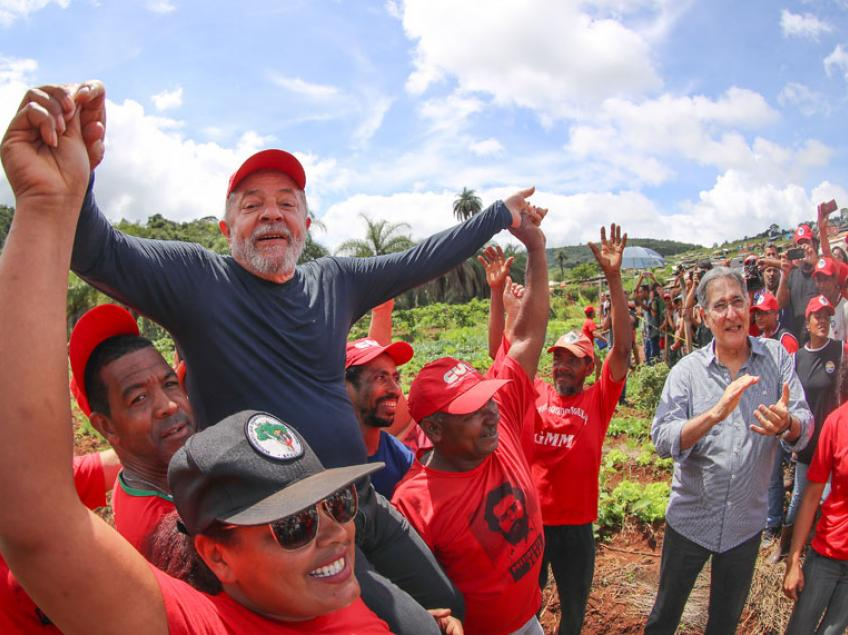

### Hi there 👋 I'm *Rikki* ~ :sparkles:

**Pronouns**: She/Her, or they/them is fine

**Location**: Berlin, DE

**Hobbies**: Dancing, Poetry, Plants, Climbing, Mischief, Mermaid things

I created `monaco-graphql`. I converted `graphiql` into a monorepo, merging the LSP service and codemirror repositories, and I help maintain `graphiql`, `graphql-playground`, the `graphql-language-service-server` and `vscode-graphql`. I was made a maintainer of graphiql after advancing the input union spec by creating reference PRs - you can become a maintainer too!

I need a replacement or three! If you want to help bottomline any of these projects, let us know!

Until then I will focus on roadmaps, issues and reviewing PRs to train the next batch of maintainers!
